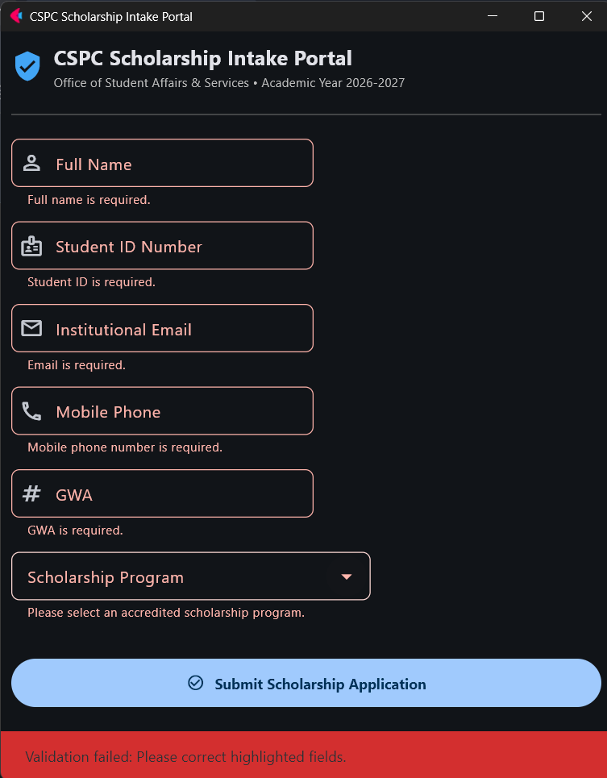
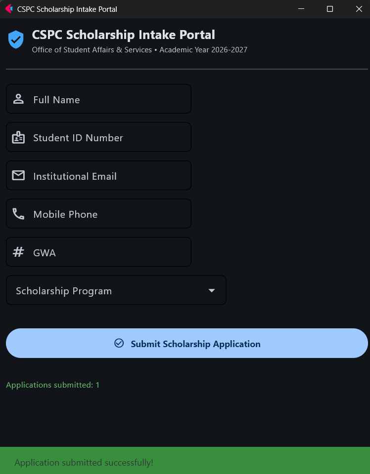

# CCCS 106: Laboratory Worksheet - CSPC Scholarship Intake Portal: Multi-Tier Form Validation & Defensive Programming in Flet

---

## 1. Group & Team Members Roster
**Group Name / Number:** Group No. 2 (Ni-Git)  
**Year & Section:** BSCS 3A  
**Date of Submission:** [2026-10-01]   
**Submitting Member:** Borja, Edmar B.  

|Role/Order|Full Name|Student ID Number|Institutional Email|Key Technical Contribution|
|:---|:---|:---|:---|:---|
|`Member 1`|Borja, Edmar B.|2411445|`edborja@my.cspc.edu.ph`|`Developer 1 (Lead UI)`|
|`Member 2`|Barandon, Noelee Anthony S.|2412863|`nonoelee@my.cspc.edu.ph`|`Developer 2 (State Logic)`|
|`Member 3`|Musa, Edurado Gabriel S.|2411276|`edmusa@my.edu.ph`|`Developer 3 QA & Milestone`|

---

## 2. Git Repository & Commit Verification
**Dedicated GitHub Repository URL:** [**CCCS 106: Laboratory Worksheet - CSPC Scholarship Intake Portal: Multi-Tier Form Validation & Defensive Programming in Flet**](https://github.com/edborja/Laboratory-Worksheet)  

**Repository Visibility** Public  


**Final Verified Commit SHA on `main`:** [Paste 7-character or 40-character commit hash, e.g., a1b2c3d]

## 3. Automated Test Suite Output (test_validation.py)
Run the `python test_validation.py -v` in your terminal and paste the full output bellow:

```text
test_dataclass_contract_creation (__main__.TestScholarshipValidator.test_dataclass_contract_creation) ... ok
test_gui_submission_flow (__main__.TestScholarshipValidator.test_gui_submission_flow) ... ok
test_invalid_email_domain (__main__.TestScholarshipValidator.test_invalid_email_domain) ... ok
test_invalid_gwa_non_numeric (__main__.TestScholarshipValidator.test_invalid_gwa_non_numeric) ... ok
test_invalid_gwa_out_of_bounds (__main__.TestScholarshipValidator.test_invalid_gwa_out_of_bounds) ... ok
test_invalid_name_empty (__main__.TestScholarshipValidator.test_invalid_name_empty) ... ok
test_invalid_name_length_and_symbols (__main__.TestScholarshipValidator.test_invalid_name_length_and_symbols) ... ok
test_invalid_phone_numbers (__main__.TestScholarshipValidator.test_invalid_phone_numbers) ... ok
test_invalid_student_id_format (__main__.TestScholarshipValidator.test_invalid_student_id_format) ... ok
test_valid_email (__main__.TestScholarshipValidator.test_valid_email) ... ok
test_valid_gwa (__main__.TestScholarshipValidator.test_valid_gwa) ... ok
test_valid_name (__main__.TestScholarshipValidator.test_valid_name) ... ok
test_valid_phone_normalization (__main__.TestScholarshipValidator.test_valid_phone_normalization) ... ok
test_valid_student_id (__main__.TestScholarshipValidator.test_valid_student_id) ... ok

----------------------------------------------------------------------
Ran 14 tests in 0.157s

OK
```

## 4. Verification Screenshots
**A. Multi-Field Validation Error State (Matching Figure 1)**
(Ensure red error borders, error descriptions, and red SnackBar are clearly visible)  


**B. Successful Application Registration State (Matching Figure 2)**
(Ensure clean form fields. Green SnackBar, and the session contract card are clearly visible)  


## 5. Technical Reflection & Engineering Audit
**Defensive Error Handling:**   
`Member 1:`  
*The program uses try-except to safely handle invalid GWA input. It shows an error message and stops the submission instead of crashing.*  

`Member 2:`  
*The use of try except code in our program helps deal with the error in case of the conversion of the GWA from string to number when a letter or an invalid number is input.*  

`Member 3:`  
*We use the try except in our program that would raise an exception when an error is detected. This will prevent the UI to crush when an invalid input has been entered.*

**Multi-Tier Separation:**  
`Member 1:`  
*Clearing the error message only changes what the user sees. Domain validation is still needed to check the data and stop invalid applications from being saved.*

`Member 2:`  
*Deleting of the error text only clears it from the display for better interaction with the form but does not perform any validation since we require domain validation to ensure that incorrect data is not saved into the applicant list.*

`Member 3:`  
*Error clearing text only allows the user to have repeated attempts, to ensure that no error occurs during registration. Domain Validation ensures that no errors actually happened, prompting the user to try again, this ensure that no faulty data is inside the databse.*

**Team Collaboration Reflection:**   
`Member 1:`  
*We worked on the Flet interface while the other members worked on validation and testing. We combined our work on GitHub and used tests to check that everything worked.* 

`Member 2:`  
*We decided to split up the tasks by assigning one member to work on the front end and another to define the rules for validation. Later, we combined the code through our repository on GitHub.*  

`Member 3:`  
*We split up the task, for a more efficient approach. We created our own respective branches and push our own work their, and merge it to the main branch once the program is running smoothly.*